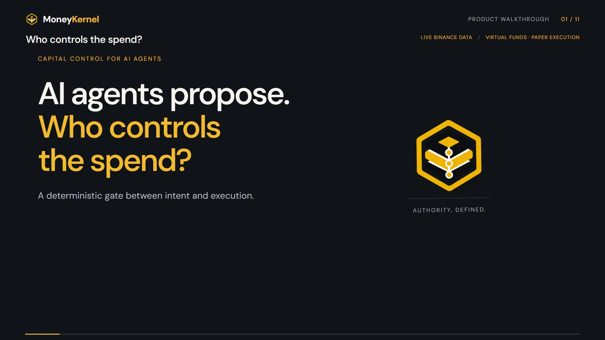
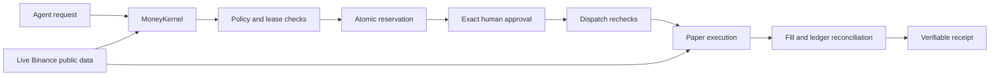
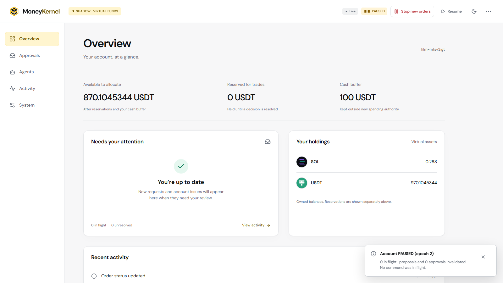

# MoneyKernel

**Give AI agents capital, not blind trust.**

[](https://github.com/Vasanthdev2004/moneykernel/actions/workflows/ci.yml)
[](LICENSE)

MoneyKernel is a capital-control gateway for AI trading agents. You set the spending limits. Agents submit trade requests. Deterministic code checks their authority and reserves funds, then you approve the exact order. Every decision and resulting fill has an inspectable receipt.

**In the recorded run:** Alpha requests **50 USDT** of SOL against a **30 USDT** budget. MoneyKernel reduces the request to **29.94 USDT** of SOL, reserves the fee, waits for exact approval, and reconciles the paper fill into the ledger.

[](https://github.com/Vasanthdev2004/moneykernel/releases/download/hackathon-2026-09-08/MoneyKernel-Demo-1080p.mp4)

**[Watch the 1:45 demo](https://github.com/Vasanthdev2004/moneykernel/releases/download/hackathon-2026-09-08/MoneyKernel-Demo-1080p.mp4)** · [Submission package](docs/submission/README.md) · [Verify the recorded run](docs/evidence/submission/README.md) · [Architecture](docs/architecture.md)

Built for the **Binance Agent OS Mini Hackathon, Track A**. The demo uses **live Binance public market data, virtual funds, and paper execution**. A read-only Binance plugin observation was separately verified in a supported Codex session. The custom backend Agent OS session remains blocked by Binance's allowlist; it is not represented as connected. See [integration evidence](docs/integration-manifest.json).

## How it works



The agent has a scoped API token and a lease: a budget, expiry, allowed markets, sides, order types, and submission allowance. It cannot enlarge that authority or approve its own request. ChatGPT, Claude, or another agent can participate through the external agent API; the demonstrated submission uses the recording driver, and a built-in hosted chat connector is not claimed.

| Capability | Evidence |
|---|---|
| Spending limits and smaller counterproposals | [Recorded 50 → under-30 USDT request](docs/evidence/submission/README.md) |
| Exact, single-use operator approval | Recorded approval binds the candidate revision, hash, and account epoch |
| Competing-agent coordination | [REPLAY conflict hold and winner revalidation](docs/evidence/demo/g7-review.md) |
| Agent quarantine | REPLAY burst test blocks request 11 and later attempts |
| Recovery after a lost response | REPLAY restart preserves the command identity and reconciles one venue submission |
| Explainable receipts and offline verification | [9/9 checks on the recorded run](docs/evidence/submission/verification.json) |

The console has **Overview, Approvals, Agents, Activity, and System**, with light/dark themes and asset icons.



## Run the live-market demo locally

Requires **Node 24.20.0** (`.nvmrc`), **pnpm 12.3.4**, and Docker with Compose. No Binance account or model API key is required for SHADOW. Run commands from the repository root.

### 1. Install and configure

```bash
git clone https://github.com/Vasanthdev2004/moneykernel.git
cd moneykernel
pnpm install --frozen-lockfile
```

Copy `.env.example` to `.env` (`cp .env.example .env` in Bash, `Copy-Item .env.example .env` in PowerShell). Run `pnpm secret:generate` and paste its output as `OPERATOR_BOOTSTRAP_SECRET` in `.env`. Also set:

```dotenv
MONEYKERNEL_MODE=SHADOW
MONEYKERNEL_ACCOUNT_ALIAS=judge-shadow-001
```

If port 5432 is occupied, change `MK_DB_HOST_PORT` and the port in **both** database URLs in `.env` to the same free port. Keep `.env` private.

```bash
docker compose up -d db
pnpm db:migrate
pnpm run doctor
```

### 2. Start the kernel and console

In terminal 1:

```bash
pnpm dev
```

In terminal 2:

```bash
pnpm dev:web
```

Open [localhost:5173](http://127.0.0.1:5173) and log in with your operator bootstrap secret. The new account starts paused until the one-time bootstrap below creates its virtual holdings, policy, and spending lease.

### 3. Initialize and submit a request

In terminal 3, create `.moneykernel` and capture the one-time agent credentials privately.

**Bash:**

```bash
mkdir -p .moneykernel
node --env-file=.env apps/kernel/src/seed-cli.ts docs/submission/shadow-bootstrap.json > .moneykernel/submission.seed.json
pnpm demo:shadow -- --seed .moneykernel/submission.seed.json
```

**PowerShell:**

```powershell
New-Item -ItemType Directory -Path .moneykernel -Force | Out-Null
$seed = node --env-file=.env apps/kernel/src/seed-cli.ts docs/submission/shadow-bootstrap.json
if ($LASTEXITCODE -ne 0) { throw 'Bootstrap failed' }
[System.IO.File]::WriteAllText((Join-Path (Get-Location) '.moneykernel/submission.seed.json'), ($seed -join [Environment]::NewLine), [System.Text.UTF8Encoding]::new($false))
pnpm demo:shadow -- --seed .moneykernel/submission.seed.json
```

Open **Approvals**, review the reduced candidate, tick the exact-approval confirmation, and approve before the two-minute proposal window expires. Open **Activity** to inspect the order, fill, and receipt. The live price and exact quantity will differ from the recording. If price drift or freshness checks refuse execution, inspect the reason; those checks remain enforced.

The bootstrap runs **once per fresh alias**. For another independent run, stop the kernel, choose a new alias in `.env`, restart, and bootstrap it. A restart of an existing account pauses it and reconciles outstanding work; use **Resume** after reviewing readiness. Do not reseed an existing account.

## Verify without a database or exchange connection

After installing dependencies:

```bash
pnpm verify:receipt -- docs/evidence/submission/run-export.json
```

Expected: `verify:receipt: passed`. This checks the actual recorded run: 18 events, one replayed decision receipt, one command, one fill, and the resulting ledger. Without an independent final-hash checkpoint, verification establishes internal consistency, not proof of upstream honesty.

## Modes and current limits

| Mode | Market data | Funds and execution | Status |
|---|---|---|---|
| REPLAY | Synthetic fixtures | Virtual funds; fixture-book paper fills | Implemented and tested |
| SHADOW | Live Binance public REST | Virtual funds; live-book paper fills | Recorded and verified |
| TESTNET | Spot Testnet read adapter | External execution unqualified | Execution refuses to start |
| Mainnet | — | No order path | Excluded |

The backend does not own a Binance Agent OS session. Hosted model-provider execution and receipt-to-model provenance remain unqualified; the supported-session evidence and limits are documented. One active kernel writer is supported; there is no hot failover. The paper venue does not establish market impact, profitability, or real exchange behavior. See [full qualification limits](docs/development.md#known-limitations-prdmd-234-26).

For a monitored private SHADOW deployment, the [Docker/Caddy runbook](docs/production-shadow.md) covers HTTPS, persistent storage, migrations, authentication, metrics, backups, restore, and rollback. That topology does not enable real-money execution.

## Validation and development

The [recorded application baseline](https://github.com/Vasanthdev2004/moneykernel/actions/runs/34246271606) passed CI: **284 unit, 7 property, 90 contract, 153 integration, 5 fault, and 7 browser tests**; three optional integration checks were skipped. [Detailed results](docs/production-readiness-evidence.md) explain the test and container boundaries.

```bash
pnpm lint
pnpm typecheck
pnpm test:unit
pnpm test:property
pnpm test:contracts
pnpm build
```

Database, fault, and browser suites share test state and must run sequentially. See [CONTRIBUTING.md](CONTRIBUTING.md). For an offline fixture run, configure `MONEYKERNEL_MODE=REPLAY` and use [the rehearsal guide](docs/demo-script.md).

| Document | Purpose |
|---|---|
| [Submission package](docs/submission/README.md) | Video, public links, project description, post draft, owner checklist |
| [Architecture](docs/architecture.md) | Packages, transaction boundaries, dispatch, reconciliation |
| [Development guide](docs/development.md) | Console, agent runner, replay, verification, known limitations |
| [Integration manifest](docs/integration-manifest.json) | Exact Binance observation provenance and blocked routes |
| [PRD](prd.md) | Product requirements, invariants, acceptance scenarios |
| [Security policy](SECURITY.md) | Supported boundary and private reporting |

## License and credits

[MIT](LICENSE) · Copyright 2026 Vasanth. Built with TypeScript, Fastify, PostgreSQL, React, Vite, Radix UI, Lucide, Zod, and decimal.js. See [third-party notices](THIRD_PARTY_NOTICES.md) for font, dependency, and media attribution.
