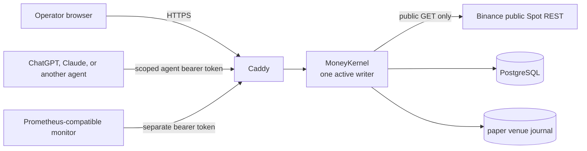

# Private SHADOW deployment

This runbook deploys MoneyKernel as a single-instance SHADOW beta. It reads current public Binance Spot market data and simulates fills against virtual funds. It has no exchange credential, custody, withdrawal, or mainnet order path.



The reverse proxy is the only public service. PostgreSQL and the kernel have no published host ports. The application container runs as a non-root user with a read-only root filesystem, all Linux capabilities dropped, and one writable volume for the paper-venue journal. Every restart pauses the account, reconciles the journal and database by stable command identity, and requires an operator to resume.

## Provision the host

Use a Linux host with Docker Engine and the Compose plugin, a DNS A/AAAA record for the deployment, and inbound TCP 80/443 plus UDP 443. Restrict access to a VPN, identity-aware proxy, or an IP allowlist when the host is reachable from the internet. Keep Docker, SSH, and PostgreSQL off the public network.

Copy the environment template and generate three unrelated values. `secret:generate` prints one 256-bit base64url secret each time.

```bash
cp deploy/production.env.example deploy/production.env
pnpm secret:generate  # POSTGRES_PASSWORD; URL-safe, also place it in DATABASE_URL
pnpm secret:generate  # OPERATOR_BOOTSTRAP_SECRET
pnpm secret:generate  # METRICS_BEARER_TOKEN
chmod 600 deploy/production.env
```

Set `MONEYKERNEL_DOMAIN` and `ACME_EMAIL`. Keep `MODEL_PROVIDER=disabled` unless a backend model route is intentionally being tested. Set `ENABLE_PUBLIC_MUTATIONS=true` only for the private operator deployment; when false, remote sessions can inspect the account but cannot approve, stop, resume, register agents, or change leases.

The production config fails closed unless `PUBLIC_ORIGIN` is HTTPS, both service secrets are strong, the database is reachable and migrated, and the process owns the single-writer lock. Caddy obtains and renews the TLS certificate. Do not expose port 8080 directly or enable `TRUST_PROXY` behind an untrusted intermediary.

## Deploy and initialize

Validate the resolved Compose file before starting it. This catches missing environment values without printing application secrets in logs.

```bash
docker compose --env-file deploy/production.env -f compose.production.yaml config --quiet
docker compose --env-file deploy/production.env -f compose.production.yaml build --pull
docker compose --env-file deploy/production.env -f compose.production.yaml up -d
docker compose --env-file deploy/production.env -f compose.production.yaml ps
```

The migration container must exit successfully before the app starts, and Caddy waits for application liveness. Verify the public edge:

```bash
curl --fail "https://${MONEYKERNEL_DOMAIN}/health/live"
curl --fail "https://${MONEYKERNEL_DOMAIN}/health/ready"
curl --fail -H "Authorization: Bearer ${METRICS_BEARER_TOKEN}" \
  "https://${MONEYKERNEL_DOMAIN}/metrics"
```

For a new account alias, copy and review the SHADOW bootstrap profile. Its balances are virtual capital; its policy and lease determine the agent's maximum authority. The command is one-time and refuses an account that already contains run data.

```bash
cp deploy/shadow-bootstrap.example.json deploy/shadow-bootstrap.json
# Edit balances, policy, agent identity, symbols, budget, attempts, and lease duration.
docker compose --env-file deploy/production.env -f compose.production.yaml run --rm --no-deps \
  -v "$(pwd)/deploy/shadow-bootstrap.json:/run/shadow-bootstrap.json:ro" \
  app --import tsx src/seed-cli.ts /run/shadow-bootstrap.json
```

Capture the printed agent bearer tokens in a secret manager; they are never shown again. Open `https://$MONEYKERNEL_DOMAIN`, exchange the operator bootstrap secret for a session, review System readiness and integration provenance, then resume if the account is paused. An external ChatGPT or Claude agent reads `/v1/agent/context` and submits one structured proposal to `/v1/agent/intents` with its scoped bearer token. It cannot approve its proposal, change policy, or reach Binance through MoneyKernel.

## Monitoring

Scrape `GET /metrics` with `Authorization: Bearer $METRICS_BEARER_TOKEN`. The endpoint exposes no operator or agent token and uses bounded route-template labels. Alert when:

- `moneykernel_ready` is `0` for more than two checks;
- `moneykernel_unknown_commands` or `moneykernel_in_flight_commands` is above `0` unexpectedly;
- no market observation is available after an attempted proposal, or snapshot age exceeds policy;
- the container restarts, the migration job fails, or `/health/live` stops responding.

Application and Caddy logs are structured JSON on stdout. Retain them outside the container. The database audit chain remains the execution record; logs and metrics are operational signals.

## Backup and restore

Before every deployment, use **Stop new orders**, confirm there are no outstanding commands, and export the current run from the console. Then create a database dump and copy the paper journal under one timestamp:

```bash
stamp="$(date -u +%Y%m%dT%H%M%SZ)"
mkdir -p "deploy/backups/$stamp"
docker compose --env-file deploy/production.env -f compose.production.yaml exec -T db \
  pg_dump -U moneykernel -d moneykernel --format=custom --file=/tmp/moneykernel.dump
docker compose --env-file deploy/production.env -f compose.production.yaml \
  cp db:/tmp/moneykernel.dump "deploy/backups/$stamp/moneykernel.dump"
docker compose --env-file deploy/production.env -f compose.production.yaml \
  cp app:/var/lib/moneykernel/. "deploy/backups/$stamp/state"
sha256sum "deploy/backups/$stamp/moneykernel.dump" > "deploy/backups/$stamp/SHA256SUMS"
```

Encrypt and copy the backup off-host. Test restore on a separate host/account alias. A restore replaces local history, so stop Caddy and the app first, take a fresh backup, verify the checksum, recreate the database, restore the matching state directory, and start the stack. The account starts paused and must reconcile before Resume.

```bash
docker compose --env-file deploy/production.env -f compose.production.yaml stop caddy app
sha256sum -c "deploy/backups/$stamp/SHA256SUMS"
docker compose --env-file deploy/production.env -f compose.production.yaml cp \
  "deploy/backups/$stamp/moneykernel.dump" db:/tmp/restore.dump
docker compose --env-file deploy/production.env -f compose.production.yaml exec -T db sh -eu -c \
  'dropdb -U moneykernel --if-exists moneykernel; createdb -U moneykernel moneykernel; pg_restore -U moneykernel -d moneykernel --exit-on-error /tmp/restore.dump'
docker compose --env-file deploy/production.env -f compose.production.yaml run --rm --no-deps \
  -v "$(pwd)/deploy/backups/$stamp/state:/restore:ro" \
  -v "moneykernel_kernel-state:/var/lib/moneykernel" --entrypoint sh caddy -eu -c \
  'rm -rf /var/lib/moneykernel/*; cp -a /restore/. /var/lib/moneykernel/'
docker compose --env-file deploy/production.env -f compose.production.yaml up -d
```

## Upgrade and rollback

Stop admission and settle every known command before changing the image. Back up the database and journal, build or pull the reviewed image, run the migration gate, and start exactly one app replica. Inspect `/health/ready`, log in, review incidents, and resume manually.

If an upgrade fails, keep admission stopped. Terminate the new writer before starting the old image. Roll back only to code compatible with the migrated schema; restore the paired database and journal backup if schema compatibility is uncertain. Never roll back the database alone and never infer that an external effect disappeared because code was reverted.

## Release boundary

This topology is suitable for a private, monitored SHADOW beta. Its production controls do not qualify TESTNET execution, implement hot failover, externally anchor the audit chain, or create a real-money path. Adding mainnet credentials or a `LIVE` mode remains a startup error and requires a separate product and security review.
